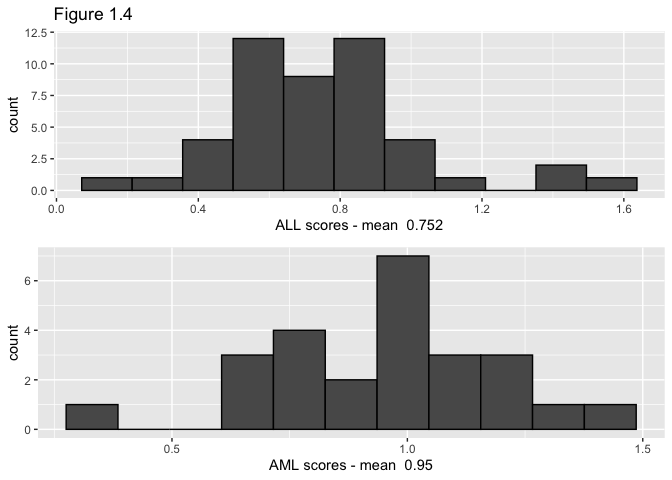

Ch 1-3
================
Soobin Kim
1/18/2021

``` r
library(tidyverse)
```

    ## ── Attaching packages ─────────────────────────────────────────────────────────────── tidyverse 1.3.0 ──

    ## ✓ ggplot2 3.3.2     ✓ purrr   0.3.4
    ## ✓ tibble  3.0.3     ✓ dplyr   1.0.2
    ## ✓ tidyr   1.1.2     ✓ stringr 1.4.0
    ## ✓ readr   1.3.1     ✓ forcats 0.5.0

    ## ── Conflicts ────────────────────────────────────────────────────────────────── tidyverse_conflicts() ──
    ## x dplyr::filter() masks stats::filter()
    ## x dplyr::lag()    masks stats::lag()

# Ch 1. Algorithms and Inference

## Fig 1.1

``` r
kidney <- read.table("https://web.stanford.edu/~hastie/CASI_files/DATA/kidney.txt", header=T)
kidney_lm <- lm(data = kidney, tot ~ age)

slr_se <- function(newx, lm_fit){
  n <- length(lm_fit$residuals)
  sigma_hat <- sqrt(sum((lm_fit$residuals)^2)/n)
  x <- lm_fit$model[,2]
  xbar <- mean(x)
  ssx <- sum((x - xbar)^2)
  sigma_hat * sqrt(1/n + (newx - xbar)^2/ssx)
}
kidney_lmse <- slr_se(seq(from = 20, to = 80, by = 10), lm_fit = kidney_lm)
kidney_lmfit <- rbind(
  predict(kidney_lm, newdata = data.frame(age = seq(from = 20, to = 80, by = 10))) - 2*kidney_lmse,
  predict(kidney_lm, newdata = data.frame(age = seq(from = 20, to = 80, by = 10))) + 2*kidney_lmse
                      )

plot(kidney$age, kidney$tot, xlab = "age", ylab = "tot", main = "Figure 1.1", pch = "*")
abline(a = kidney_lm$coefficients[1], b = kidney_lm$coefficients[2], col = "red")
for(i in 1:7){
  lines(rep(10*(i+1), 2), kidney_lmfit[,i])
}
```

<!-- -->

``` r
##or use ggplot

ggplot(data = kidney, aes(x = age, y = tot)) +
  geom_point() +
  geom_smooth(method = lm, formula = y~x, se = T, level = 0.9544997) + ##level set to match 2*se
  labs(title = "Fig 1.1 with ggplot")
```

<!-- -->

## Fig 1.2

``` r
kidney_lowess <- data.frame(lowess(x = kidney$age, y = kidney$tot, 1/3))

plot(kidney$age, kidney$tot, xlab = "age", ylab = "tot", main = "Figure 1.2 w/o se", pch = "*")
lines(kidney_lowess$x, kidney_lowess$y, col = "red")
```

<!-- -->

To calculate se of lowess curve, we should do some bootstrap. See
[below](#fig-1.3).

Or use loess curve, which is easily implemented with `ggplot`. Though
loess can be simply understood as a generalization of lowess, two
methods certainly have differences and produce difference outputs. Check
[here](https://stat.ethz.ch/pipermail/bioconductor/2003-September/002337.html)
or
[here](https://stackoverflow.com/questions/27704985/different-lowess-curves-in-plot-and-qplot-in-r).

``` r
ggplot(data = kidney, aes(x = age, y = tot)) +
  geom_point() +
  geom_smooth(method = loess, formula = y~x, se = T, level = 0.9544997) +
  labs(title = "Fig 1.2 with ggplot; loess")
```

<!-- -->

## Fig 1.3

``` r
set.seed(111)
kidney_boot <- list()
for(i in 1:250){
  boot_ind <- sort(sample(1:157, 157, replace = T))
  kidney_boot[[i]] <- lowess(x = kidney$age[boot_ind], y = kidney$tot[boot_ind], 1/3)
}

{plot(kidney$age, kidney$tot, xlab = "age", ylab = "tot", main = "Figure 1.3", pch = "*")
for(i in 1:25){
  lines(kidney_boot[[i]]$x, kidney_boot[[i]]$y)
}
lines(kidney_lowess$x, kidney_lowess$y, col = "red")}
```

<!-- -->

When calculating se of a certain value of x, `approxfun` is used since
there is no predict methods of lowess fit. Idea borrowed from
[here](https://stats.stackexchange.com/questions/126699/residuals-from-lowess-curve).

Results are quite similar to Table 1.1.

``` r
kidney_boot_p <- data.frame(x=rep(seq(20, to=80, by=10), 250),
                            y=vector(length = 250*7),
                            ind=rep(1:250, each=7))
for(i in 1:250){
  fun <- approxfun(kidney_boot[[i]], ties = min)
  kidney_boot_p$y[seq(from=7*i-6, to=7*i)] <- sapply(seq(20, to=80, by=10), fun)
}

(kidney_se <- kidney_boot_p %>%
  group_by(x) %>%
  summarise(bs_se_lowess = sd(y, na.rm = T)) %>%
  mutate(se_lr = kidney_lmse) %>%
  round(., 2))
```

    ## `summarise()` ungrouping output (override with `.groups` argument)

    ## # A tibble: 7 x 3
    ##       x bs_se_lowess se_lr
    ##   <dbl>        <dbl> <dbl>
    ## 1    20         0.65  0.21
    ## 2    30         0.23  0.15
    ## 3    40         0.33  0.15
    ## 4    50         0.34  0.19
    ## 5    60         0.39  0.26
    ## 6    70         0.44  0.33
    ## 7    80         0.6   0.42

``` r
kidney_lwp <- sapply(seq(20, to=80, by=10), approxfun(kidney_lowess, ties = min))

{plot(kidney$age, kidney$tot, xlab = "age", ylab = "tot", main = "Figure 1.2", pch = "*")
lines(kidney_lowess$x, kidney_lowess$y, col = "red")
for(i in 1:7){
  lines(rep(10*(i+1), 2), 
        c(kidney_lwp[i]-2*kidney_se$bs_se_lowess[i], kidney_lwp[i]+2*kidney_se$bs_se_lowess[i]))
}}
```

<!-- -->

## Fig 1.4

``` r
leukemia_big <- read.csv("http://web.stanford.edu/~hastie/CASI_files/DATA/leukemia_big.csv")
z <- vector(length=72)
for(i in 1:72){
  z[i] <- strsplit(colnames(leukemia_big), "[.]")[[i]][1]
}
leukemia_big <- data.frame(t(leukemia_big))

leukemia_big$group <- z
####################
leukemia_big %>%
  group_by(group) %>%
  summarise(M = mean(X136))
```

    ## `summarise()` ungrouping output (override with `.groups` argument)

    ## # A tibble: 2 x 2
    ##   group     M
    ##   <chr> <dbl>
    ## 1 ALL   0.752
    ## 2 AML   0.950

``` r
leukemia_big %>%
  filter(group == "ALL") %>%
  ggplot(data=., aes(x = X136)) + geom_histogram(bins=11) +
  labs(title = "Fig1.4 ALL")
```

<!-- -->

``` r
leukemia_big %>%
  filter(group == "AML") %>%
  ggplot(data=., aes(x = X136)) + geom_histogram(bins=11) +
  labs(title = "Fig1.4 AML")
```

<!-- -->

``` r
####################
# leukemia_small <- read.csv("leukemia_small.csv", header = T)
# z <- vector(length=72)
# for(i in 1:72){
#   z[i] <- strsplit(colnames(leukemia_small), "[.]")[[i]][1]
# }
# leukemia_small <- data.frame(t(leukemia_small))
# 
# leukemia_small$group <- z
# ##################
# leukemia_small %>%
#   group_by(group) %>%
#   summarise(M = mean(X136))
```

## Fig 1.5

``` r
get_t <- function(d){
  #colnames(d) <- c("gene", "group")
  x1 <- d %>% filter(group == "AML") %>% pull(1)
  x2 <- d %>% filter(group == "ALL") %>% pull(1)
  sigma_hat <- (sum((x1 - mean(x1))^2) + sum((x2 - mean(x2))^2))/70
  #print(x1)
  sd_hat <- sqrt(sigma_hat * (1/25 + 1/47))
  t <- (mean(x1) - mean(x2))/sd_hat
  return(t)
}

#get_t(leukemia_big[,c(1,7129)])
###############################
leuk_t <- c()
for(i in 1:7128){
  leuk_t[i] <- get_t(leukemia_big[,c(i,7129)])
}

hist(leuk_t)
```

<!-- -->

``` r
leuk_t[136]
```

    ## [1] 3.014003

``` r
###############################
# leuk_smallt <- c()
# for(i in 1:3571){
#   leuk_smallt[i] <- get_t(leukemia_small[,c(i,3572)])
# }
# 
# hist(leuk_smallt)
```

# Ch 3. Bayes

``` r
##Normal means model

# z <- pt(leuk_smallt, df = 3569)
# nm_x <- qnorm(z)
# 
# hist(nm_x)
```
