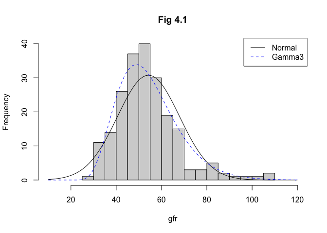
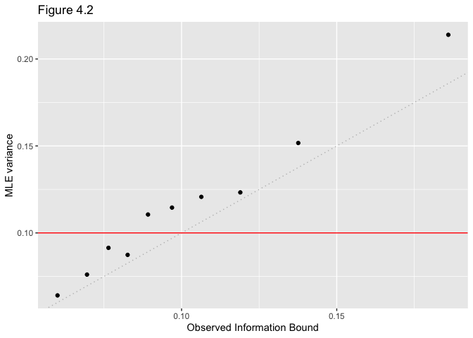
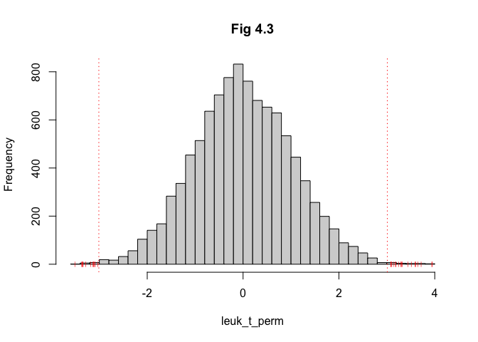

Ch 4
================
Soobin Kim
1/24/2021

``` r
source("functions_and_data.r")
library(tidyverse)
```

    ## ── Attaching packages ───────────────────────────────────────────────────────── tidyverse 1.3.0 ──

    ## ✓ ggplot2 3.3.2     ✓ purrr   0.3.4
    ## ✓ tibble  3.0.3     ✓ dplyr   1.0.2
    ## ✓ tidyr   1.1.2     ✓ stringr 1.4.0
    ## ✓ readr   1.3.1     ✓ forcats 0.5.0

    ## ── Conflicts ──────────────────────────────────────────────────────────── tidyverse_conflicts() ──
    ## x dplyr::filter() masks stats::filter()
    ## x dplyr::lag()    masks stats::lag()

``` r
library(gridExtra)
```

    ## 
    ## Attaching package: 'gridExtra'

    ## The following object is masked from 'package:dplyr':
    ## 
    ##     combine

# Ch 4. Fisherian Inference and Maximum Likelihood Estimation

## Figure 4.1

Here we are willing to fit Gamma3 distribution to gfr data using MLE.
Gamma3, three parameter gamma distribution (lower limit of x, usually
set to 0, is added as a parameter to the well-known gamma distribution),
is available in `FAdist` package. Since MLE of gamma distribution does
not have a closed-form, I used `fitdistrplus` package as an easy
solution.

``` r
# Normal MLE
#gfr <- read.table("https://web.stanford.edu/~hastie/CASI_files/DATA/gfr.txt")$V1
(gfr_mu_hat <- mean(gfr))
```

    ## [1] 54.2654

``` r
(gfr_sigma_hat <- sqrt(var(gfr)*210/211))
```

    ## [1] 13.68833

``` r
# Gamma mle 
suppressPackageStartupMessages(library(fitdistrplus))
suppressPackageStartupMessages(library(FAdist))

gfr_gammfit <- fitdist(gfr, "gamma3", method = "mle",
                       start=list(shape=1,scale=1,thres=0.5),
                       upper=c(Inf,Inf,min(gfr)))
gfr_gammfit$estimate
```

    ##     shape     scale     thres 
    ##  6.160773  5.381815 21.108277

``` r
# plot
gfr_hist <- hist(gfr, breaks = 25, main = "Fig 4.1",
                 xlim = c(10, 120))
curve(dnorm(x, gfr_mu_hat, sd = gfr_sigma_hat)*211*diff(gfr_hist$mids)[1], add = T)
curve(dgamma3(x,shape = gfr_gammfit$estimate[1], scale = gfr_gammfit$estimate[2],
              thres = gfr_gammfit$estimate[3])*211*diff(gfr_hist$mids)[1], 
      add = T, col = "blue", lty = "dashed")
legend("topright", legend = c("Normal", "Gamma3"),
       col = c("black", "blue"), lty = c("solid", "dashed"))
```

<!-- -->

## Figure 4.2

``` r
ll2 <- function(x, theta){ ##2nd deriv log likelihood of Cauchy dist'n
  2*sum(-1/(1+(x-theta)^2)+2*((x-theta)/(1+(x-theta)^2))^2)
} 

func <- function(n, plot=T){
  thetahat <- vector(length=10000)
  fisher_var <- vector(length=10000)
  for(i in 1:10000){
    x <- rcauchy(n, location=0) #theta=0
    #thetahat[i] <- mle(0.0001, 400, median(x), x)
    thetahat[i] <- optimize(function(theta) -sum(dcauchy(x, location=theta,log=TRUE)),
                            c(-100,100))$minimum
    fisher_var[i] <- -1/ll2(x, thetahat[i])
  }
  ind <- order(fisher_var)
  df <- data.frame(
    id = 1:10000,
    theta_hat = thetahat[ind],
    fisher_var = fisher_var[ind])
  if(plot==T){
      pl <- 
        df %>% 
        mutate(group = floor((id-1)/1000) + 1) %>%
        group_by(group) %>%
        summarise(emp_var = var(theta_hat),
               fisher_var_med = median(fisher_var)) %>%
        ggplot(data=., aes(x=fisher_var_med, y=emp_var)) +
        geom_point() +
        geom_abline(slope = 1, intercept = 0, colour="grey", linetype = "dotted") +
        geom_hline(yintercept = 2/n, colour = "red")
      return(list(df=df, plot=pl))
  } else {
    return(df)
  }
}
```

``` r
#### plot
set.seed(111)
res20 <- func(20, plot=T)
```

    ## `summarise()` ungrouping output (override with `.groups` argument)

``` r
res20$plot + ggtitle("Figure 4.2") +
  xlab("Observed Information Bound") +
  ylab("MLE variance")
```

<!-- -->

## Figure 4.3

``` r
leuk_t_perm <- c()
gene136 <- leukemia_big[,c(136, 7129)]

set.seed(121)
for(i in 1:10000){
  newlab <- sample(pull(gene136, group), 72, replace = F)
  perm_136 <- data.frame(X136 = gene136$X136, group = newlab)
  leuk_t_perm[i] <- get_t(perm_136) #function from Ch 3
}

(sum(abs(leuk_t_perm) > 3.01)/10000)
```

    ## [1] 0.0031

Compared with permutation significance level 0.0026 from the textbook,
I’ve got 0.0031. Fairly similar, I’d say..!

``` r
hist(leuk_t_perm, breaks = 50, main = "Fig 4.3")
abline(v = c(-3.01, 3.01), col = "red", lty = "dotted")
points(cbind(matrix(leuk_t_perm[which(abs(leuk_t_perm) >= 3.01)], nrow=31),
      rep(0, 31)), col="red", pch="|", cex=.5)
```

<!-- -->
